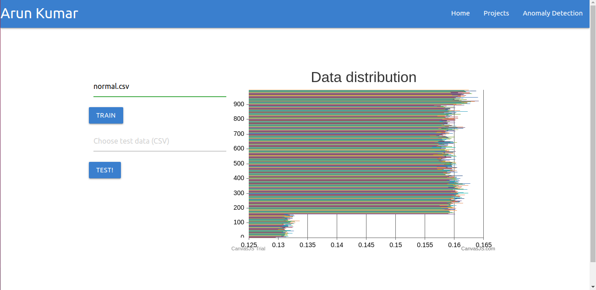

Hi 👋 I'm Arun. This is my portfolio repository and it is [live](https://backpropguy.herokuapp.com/)!


## Use my anomaly detection service!

* Go to https://backpropguy.herokuapp.com/anomaly-detection


* Select a CSV file that has "normal" data by clicking on the *`Choose reference data (CSV)`* field.


* Click **TRAIN** button. This will fit the data to find mean and standard deviation of the normal data.



* Click *`Choose test data (CSV)`* field to select the test data you want to find anomalies in.


**Note:** You can use the sample data at *public/assets/data/normal.csv* and *public/assets/data/test.csv*.


## Great! so how do I use it locally?

**Install using NPM**

```
$ git clone https://github.com/ioarun/sit725-2021-t2-prac9
```
```
$ cd sit725-2021-t2-prac9/
```
```
$ npm install 
```

**Install using Docker**

**Note:** Docker version 19.03.11

Pull the image from docker.

```
$ docker pull ioarun/sit725-2021-t2-prac9
```
Build docker.

```
docker build -t ioarun/sit725-2021-t2-prac9
```

Run docker
```
sudo docker run -d -p 5000:8080 ioarun/sit725-2021-t2-prac9
```

## Show time!
Next, go to localhost:5000 and you see the website up and running!

## Questions?

You can reach out to me on twitter @backpropguy. Happy to chat about data science and software engineering.


